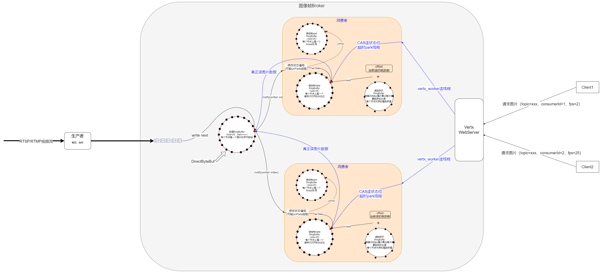

# mjpeg-broker
用于接收mjpeg流，并提供http接口消费jpeg的，一写多读、无锁、零拷贝的broker
# 生产者写入jpeg图片
ffmpeg -fflags nobuffer -fflags discardcorrupt -err_detect ignore_err -rtsp_transport tcp -i rtsp://user:password@ip:554/Streaming/Channels/101 -an -f mjpeg tcp://127.0.0.1:9092?client_id=123

我这边使用的是修改了源码的ffmpeg，实现tcp刚建立连接时先发送queryString参数(client_id)，对于原生ffmpeg无次功能，所以在broker端接收到tcp连接时，如果解析不到client_id参数会使用默认值

# 架构设计
